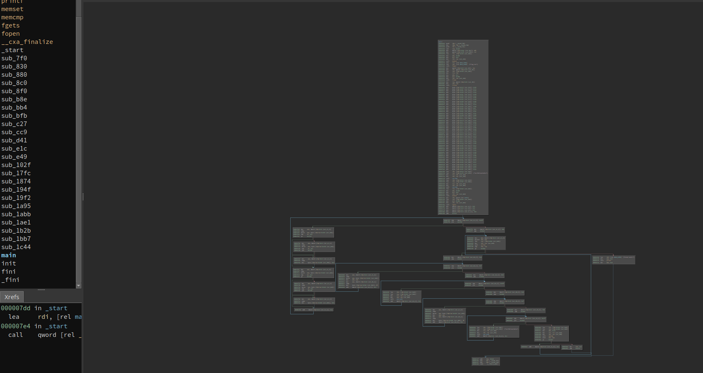
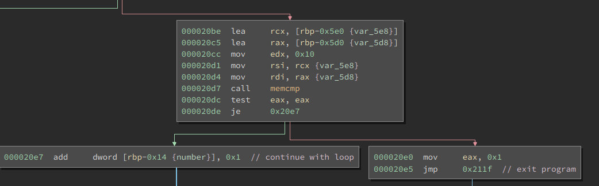

Congratulations to all teams for participating in CySCA 2018.


This challenge was heavily obfuscated and our first thought on solving this challenge was `angrangrangrangr`.

Looking at the disassembly graph in BinaryNinja it became more obvious that this challenge was simply a reversing challenge and was solvable using angr. We spent ~1 hours following this rabbot hole, however we noticed that if it had just been an angr challenge, there wouldn't have been a need to connect remotely to get the flag.




After reversing the binary it became more and more clear what was happening.

* First the binary opens a file `flag.txt` and reads the file into a buffer (rbp-0x430)
* It then reads in 0x400 bytes from stdin into a buffer (rbp-0x9e0)
* The first blocks of assembly are looping through each buffer and replacing the first newline with a NULL byte
* The program then loops over each character in our input, passing it through many sub functions, and either continuing with the loop, or ending, printing "Great Work!"


The program basically breaks down to the following



It compares two bytes of memory, and ends the program if they're not equal, continues otherwise.

From this I had an idea of what was happening. My concept of the program was as follows:

* Reads in input/flag
* Compares character by character if they are the same
* If they aren't the same exit
* If they are the same (up to the length of our input) return "Great Work!"

We confirmed our belief by testing the program.
Running it with input `flag` returns nothing whilst running it with input `FLAG` returns "GREAT Work!"

From this information we can build a brute forcing script that tries 1 character at a time untilthe flag is complete.


Here is a simple python script that connects to the server, trying each character.

```python
from pwn import *

context.log_level = 'CRITICAL' #to disable startup msgs

def tryflag(flag):
    p = process("./chal1") #remote("IP", PORT)
    p.sendline(flag)
    try:
        if "Great" in p.recvall(): 
            return True
        p.close()
    except:
        return False # if program crashes

    return False


start = 'FLAG'
letters = '0123456789FLAG{}ABCDEF_' # Only possible letters are hexidecimal digits

while True:
    for letter in letters:
        if tryflag(start + letter):
            start += letter
            print start
            break
    else:
        print "done"
        break

```


