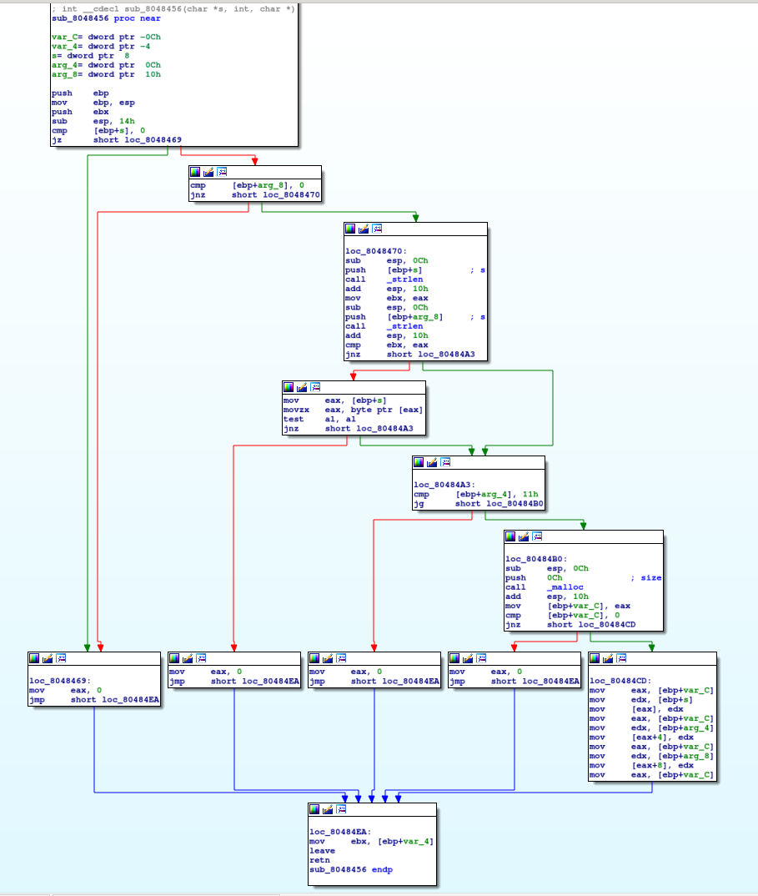
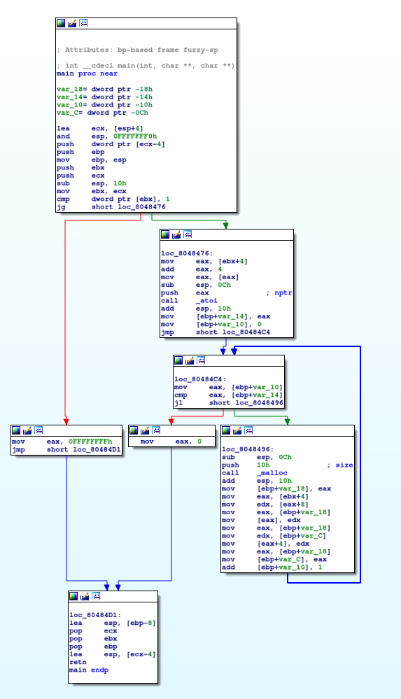

If you want the source to compare hmu on slack `@adamt`
<br />
sorry that the first chal is messed up the compiler did random shit... (skip it is hard)

first chal
---------------------


<details><summary>Challenge 1 Solution</summary>
<p>
```c
int printEvenSum(int* a) {
    int sum = 0;
    for(int i = 0; i < 50; i++) {
        if (a[i] % 2 == 0) {
            sum += a[i];
        }
    }   
}

```

</p>
</details>

<br />

second first chal
------------------



<br />


third chal
----------------------


